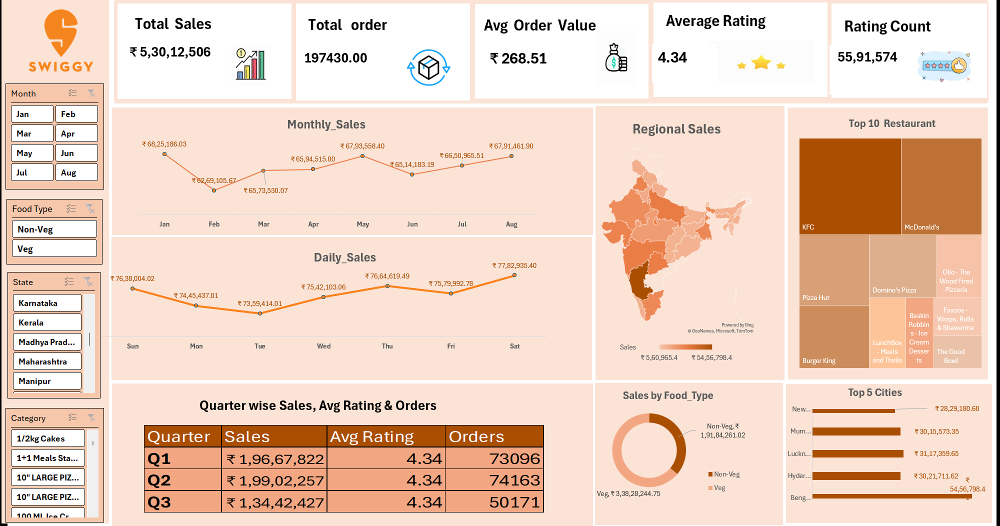

# Swiggy Sales Data Analysis

## Project Overview

This project presents a data analytics dashboard created using Excel to analyze Swiggy sales and order data.

The dashboard provides insights into sales performance, orders, ratings, restaurants, food types, states, and cities.

## Dashboard Preview

# Swiggy Sales Dashboard

The dashboard provides insights into sales performance, orders, revenue, and other key metrics.

## Dashboard Preview



## Key Performance Indicators

- Total Sales: ₹5,30,12,506
- Total Orders: 1,97,430
- Average Order Value: ₹268.51
- Average Rating: 4.34
- Rating Count: 55,91,574

## Analysis Performed

The dashboard analyzes:

- Monthly Sales
- Daily Sales
- Quarterly Sales
- Total Orders
- Average Order Value
- Average Rating
- Rating Count
- Regional Sales
- Top Restaurants
- Top Cities
- Sales by Food Type
- Veg vs Non-Veg Sales

## Key Insights

1. Total sales are approximately ₹5.30 crore from 1.97 lakh orders.
2. January records the highest monthly sales in the displayed period.
3. Saturday records the highest daily sales.
4. Veg food contributes a larger share of sales than Non-Veg food in the displayed data.
5. Bengaluru has the highest sales among the Top 5 cities shown.
6. KFC and McDonald's are among the largest contributors in the Top 10 Restaurant analysis.

## Tools Used

- Microsoft Excel
- Excel Pivot Tables
- Excel Charts
- Excel Slicers
- Data Cleaning
- Data Visualization
- Dashboard Design

## Dashboard Features

The dashboard includes interactive filters for:

- Month
- Food Type
- State
- Category

These filters allow users to explore the data from different perspectives.

## Project Structure

```text
swiggy-sales-data-analysis/
│
├── README.md
├── swiggy_sales_dashboard.xlsx
└── images/
    └── swiggy_dashboard.png
## Author
Moksha Durga
